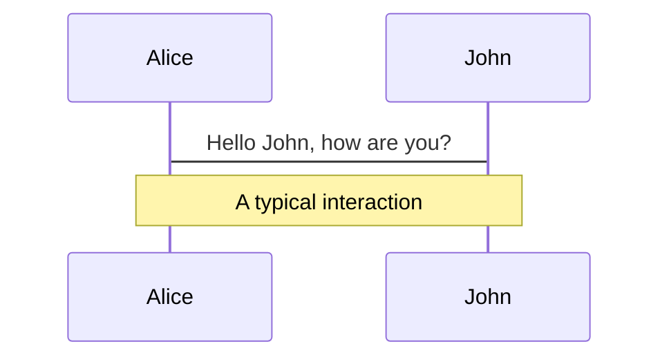
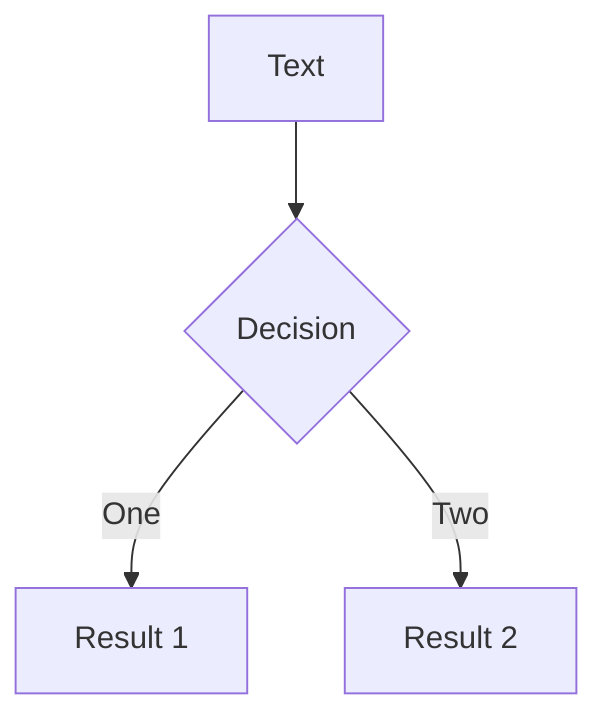
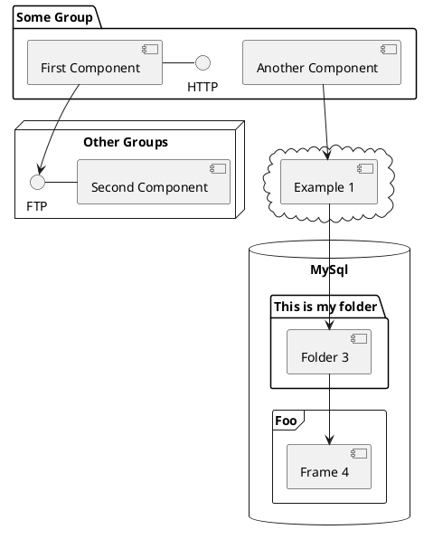

---
# try also 'default' to start simple
theme: default
# https://sli.dev/custom/highlighters.html
highlighter: shiki
# show line numbers in code blocks
lineNumbers: false
background: https://source.unsplash.com/XgeZu2jBaVI/1920x1080
# some information about the slides, markdown enabled
info: |
  ## Slidev Starter Template
  Presentation slides for developers.

  Learn more at [Sli.dev](https://sli.dev)
# persist drawings in exports and build
drawings:
  persist: false
# page transition
transition: fade-out
# use UnoCSS
css: unocss
---

# Becoming an Open-Source Contributor

<p class="c-gray-400">
  Memahami Dunia Open-Source: Dari Ide hingga Berkontribusi.
</p>

Kalwabed Rizki

<div class="text-sm abs-bl !pb-8 pl-12">
  <div class="flex items-center">
    

  <div class="text-left">
    <span>Komunitas Programmer Banyuwangi</span>
    <p class="c-gray-400 !p-0 !m-0">
      18 Februari 2023
    </p>
  </div>
  </div>
</div>

---
title: Kalwabed Rizki
layout: two-cols
---

<div class="mt-8">
  <h1 class="!c-white !text-5xl !pt-8">
    Kalwabed Rizki
  </h1>

  <div class="c-gray-400 mt-8">
    <p>
    Fullstack web engineer at F&B startup.
    </p>
    <p>
    TypeScript and open-source enthusiasts.
    </p>
    <p>
    Part of JogjaJS.
    </p>
  </div>

  <div class="flex gap-4 items-center mt-12 text-sm">
    <ph-github-logo class="c-gray-500" />
    <a href="https://github.com/kalwabed">kalwabed</a>
  </div>
  <div class="flex gap-4 items-center mt-4 text-sm">
    <ph-globe class="c-gray-500" />
    <a href="https://www.kalwabed.xyz">kalwabed.xyz</a>
  </div>
  <div class="flex gap-4 items-center mt-4 text-sm">
    <ph-instagram-logo class="c-gray-500" />
    <a href="https://www.instagram.com/kalwabed">kalwabed</a>
  </div>
  <div class="flex gap-4 items-center mt-4 text-sm">
    <ph-twitter-logo class="c-gray-500" />
    <a href="https://twitter.com/kalwabedrzk">kalwabedrzk</a>
</div>


</div>

::right::


<!--
Nama saya Kalwabed Rizki. Saya seorang Fullstack Web Engineer di salah satu F&B Startup di Indonesia. Saya sudah menggeluti dunia industri teknologi sejak sekitar 2 tahunan ini. Saya tinggal di Jogja, sekarang lagi pulang kampung di Banyuwangi. Aktif di komunitas JogjaJS, dan Menjadi member KPB sejak 2019.
-->

---
layout: section
---

# Open source?

let me introduce myself

---
---

# What is Open Source?
Perangkat lunak yang memiliki sumber kode terbuka yang dapat dilihat, diedit, dan dikembangkan oleh siapa saja.

<div class="flex justify-between">


</div>

---
---

# Open Source History


<!--
Sejarah open-source software dimulai pada tahun **1950-an dan 1960-an**, saat programmer memulai untuk bekerja sama dan berbagi kode sumber mereka. Pada tahun **1968, Richard Stallman memulai proyek GNU (GNU's Not Unix)**, bertujuan untuk menciptakan sistem operasi kompatibel Unix yang sumber kodenya terbuka.

Pada tahun 1985, Stallman menciptakan organisasi Free Software Foundation (FSF) untuk mempromosikan dan mempertahankan filosofi perangkat lunak bebas dan terbuka. **Pada tahun 1989, Stallman mengeluarkan lisensi publik general GNU (GPL)**, yang menjadi lisensi open-source paling populer hingga sekarang.

**Pada tahun 1991, Linus Torvalds memulai proyek untuk membuat sistem operasi berbasis Unix yang terbuka, yang dikenal sebagai Linux**. Pada tahun 1993, permintaan akan perangkat lunak open-source mulai meningkat, dan banyak perusahaan mulai mengadopsi dan mengembangkan teknologi ini.

Sejak saat itu, open-source software telah berkembang menjadi industri besar, dengan ribuan perangkat lunak dan proyek terbuka yang tersedia bagi siapa saja untuk digunakan dan dikembangkan. Saat ini, open-source software digunakan dalam berbagai sektor, termasuk bisnis, pemerintahan, pendidikan, dan teknologi.
-->

---
layout: statement
---

# But why...?
kenapa harus open source?

---
---

# Why Are People Choosing Open Source?

<div class="flex justify-between">

1. Fleksibilitas <ph-check class="c-green" />
2. Kualitas <ph-check class="c-green" />
3. Harga <ph-check class="c-green" />
4. Keamanan <ph-check class="c-green" />
5. Kolaborasi <ph-check class="c-green" />
6. Transparansi <ph-check class="c-green" />


</div>

<!--
1. Fleksibilitas: Perangkat lunak open-source dapat dilihat, diedit, dan dikembangkan oleh siapa saja, memungkinkan pengguna untuk menyesuaikan dan memodifikasi perangkat lunak untuk memenuhi kebutuhan mereka.
2. Kualitas: Karena sumber kode terbuka, perangkat lunak open-source dapat diperiksa dan ditingkatkan oleh komunitas global, memastikan bahwa perangkat lunak bekerja dengan baik dan memenuhi standar kualitas tertentu.
3. Harga: Perangkat lunak open-source biasanya gratis, membuatnya menjadi pilihan yang lebih murah bagi individu dan organisasi yang memiliki anggaran terbatas.
4. Keamanan: Karena sumber kode terbuka, masalah keamanan dapat segera dikenali dan difix oleh komunitas, memastikan bahwa perangkat lunak aman untuk digunakan.
5. Kolaborasi: Perangkat lunak open-source memungkinkan kolaborasi antar programmer dan organisasi dari seluruh dunia, mempercepat inovasi dan pengembangan.
6. Transparansi: Perangkat lunak open-source memungkinkan pengguna untuk memahami bagaimana perangkat lunak bekerja dan memastikan bahwa perangkat lunak tidak melakukan hal-hal yang merugikan.
-->

---
layout: image-right
image: https://source.unsplash.com/collection/94734566/1920x1080
---

# Code

Use code snippets and get the highlighting directly![^1]

```ts {all|2|1-6|9|all}
interface User {
  id: number
  firstName: string
  lastName: string
  role: string
}

function updateUser(id: number, update: User) {
  const user = getUser(id)
  const newUser = { ...user, ...update }
  saveUser(id, newUser)
}
```

<arrow v-click="3" x1="400" y1="420" x2="230" y2="330" color="#564" width="3" arrowSize="1" />

[^1]: [Learn More](https://sli.dev/guide/syntax.html#line-highlighting)

<style>
.footnotes-sep {
  @apply mt-20 opacity-10;
}
.footnotes {
  @apply text-sm opacity-75;
}
.footnote-backref {
  display: none;
}
</style>

---

# Components

<div grid="~ cols-2 gap-4">
<div>

You can use Vue components directly inside your slides.

We have provided a few built-in components like `<Tweet/>` and `<Youtube/>` that you can use directly. And adding your custom components is also super easy.

```html
<Counter :count="10" />
```

<!-- ./components/Counter.vue -->
<Counter :count="10" m="t-4" />

Check out [the guides](https://sli.dev/builtin/components.html) for more.

</div>
<div>

```html
<Tweet id="1390115482657726468" />
```

<Tweet id="1390115482657726468" scale="0.65" />

</div>
</div>

<!--
Presenter note with **bold**, *italic*, and ~~striked~~ text.

Also, HTML elements are valid:
<div class="flex w-full">
  <span style="flex-grow: 1;">Left content</span>
  <span>Right content</span>
</div>
-->


---
class: px-20
---

# Themes

Slidev comes with powerful theming support. Themes can provide styles, layouts, components, or even configurations for tools. Switching between themes by just **one edit** in your frontmatter:

<div grid="~ cols-2 gap-2" m="-t-2">

```yaml
---
theme: default
---
```

```yaml
---
theme: seriph
---
```


</div>

Read more about [How to use a theme](https://sli.dev/themes/use.html) and
check out the [Awesome Themes Gallery](https://sli.dev/themes/gallery.html).

---
preload: false
---

# Animations

Animations are powered by [@vueuse/motion](https://motion.vueuse.org/).

```html
<div
  v-motion
  :initial="{ x: -80 }"
  :enter="{ x: 0 }">
  Slidev
</div>
```

<div class="w-60 relative mt-6">
  <div class="relative w-40 h-40">
    
    
    
  </div>

  <div
    class="text-5xl absolute top-14 left-40 text-[#2B90B6] -z-1"
    v-motion
    :initial="{ x: -80, opacity: 0}"
    :enter="{ x: 0, opacity: 1, transition: { delay: 2000, duration: 1000 } }">
    Slidev
  </div>
</div>

<!-- vue script setup scripts can be directly used in markdown, and will only affects current page -->
<script setup lang="ts">
const final = {
  x: 0,
  y: 0,
  rotate: 0,
  scale: 1,
  transition: {
    type: 'spring',
    damping: 10,
    stiffness: 20,
    mass: 2
  }
}
</script>

<div
  v-motion
  :initial="{ x:35, y: 40, opacity: 0}"
  :enter="{ y: 0, opacity: 1, transition: { delay: 3500 } }">

[Learn More](https://sli.dev/guide/animations.html#motion)

</div>

---

# LaTeX

LaTeX is supported out-of-box powered by [KaTeX](https://katex.org/).

<br>

Inline $\sqrt{3x-1}+(1+x)^2$

Block
$$
\begin{array}{c}

\nabla \times \vec{\mathbf{B}} -\, \frac1c\, \frac{\partial\vec{\mathbf{E}}}{\partial t} &
= \frac{4\pi}{c}\vec{\mathbf{j}}    \nabla \cdot \vec{\mathbf{E}} & = 4 \pi \rho \\

\nabla \times \vec{\mathbf{E}}\, +\, \frac1c\, \frac{\partial\vec{\mathbf{B}}}{\partial t} & = \vec{\mathbf{0}} \\

\nabla \cdot \vec{\mathbf{B}} & = 0

\end{array}
$$

<br>

[Learn more](https://sli.dev/guide/syntax#latex)

---

# Diagrams

You can create diagrams / graphs from textual descriptions, directly in your Markdown.

<div class="grid grid-cols-3 gap-10 pt-4 -mb-6">







</div>

[Learn More](https://sli.dev/guide/syntax.html#diagrams)

---
src: ./pages/multiple-entries.md
hide: false
---

---
layout: center
class: text-center
---

# Learn More

[Documentations](https://sli.dev) · [GitHub](https://github.com/slidevjs/slidev) · [Showcases](https://sli.dev/showcases.html)
